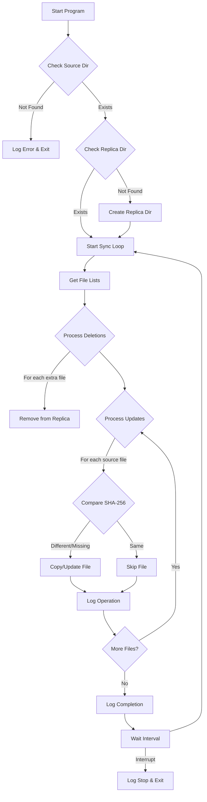

```mermaid
flowchart TD
    A[Start Program] --> B{Check Source Dir}
    B -->|Not Found| C[Log Error & Exit]
    B -->|Exists| D{Check Replica Dir}
    D -->|Not Found| E[Create Replica Dir]
    D -->|Exists| F[Start Sync Loop]
    E --> F
    F --> G[Get File Lists]
    G --> H{Process Deletions}
    H -->|For each extra file| I[Remove from Replica]
    H --> J{Process Updates}
    J -->|For each source file| K{Compare SHA-256}
    K -->|Different/Missing| L[Copy/Update File]
    K -->|Same| M[Skip File]
    L --> N[Log Operation]
    M --> N
    N --> O{More Files?}
    O -->|Yes| J
    O -->|No| P[Log Completion]
    P --> Q[Wait Interval]
    Q --> F
    Q -->|Interrupt| R[Log Stop & Exit]
```
