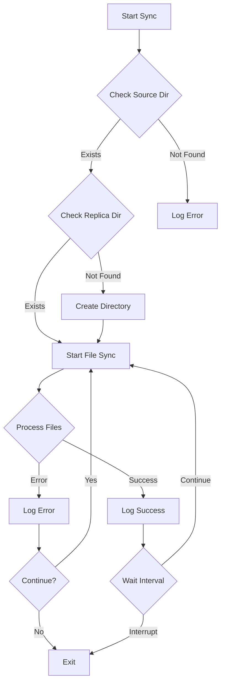

```mermaid
flowchart TD
A[Start Sync] --> B{Check Source Dir}
B -->|Exists| C{Check Replica Dir}
B -->|Not Found| E[Log Error]
C -->|Exists| D[Start File Sync]
C -->|Not Found| F[Create Directory]
F --> D
D --> G{Process Files}
G -->|Success| H[Log Success]
G -->|Error| I[Log Error]
I --> J{Continue?}
J -->|Yes| D
J -->|No| K[Exit]
H --> L{Wait Interval}
L -->|Continue| D
L -->|Interrupt| K
```
